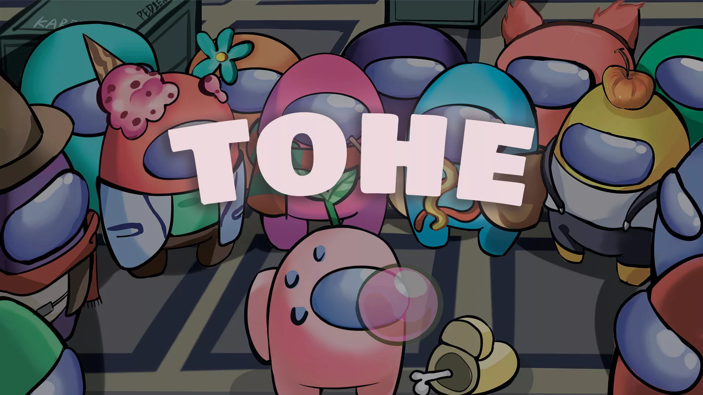

<h1 align="center">~ Town Of Next ~</h1>

 

 

> ### Regarding this mod
>
> This mod is not affiliated with Among Us or Innersloth LLC, and the content contained therein is not endorsed or otherwise sponsored by Innersloth LLC. Portions of the materials contained herein are property of Innersloth LLC. © Innersloth LLC.
>

---

## Announcement

**Since May 20, TOHE stopped development due to some reasons. At the request of many players, TOHE will maintain the most basic adaptation and synchronize updates with TOH to ensure that players in need can still play normally. By the way, TOHE has renamed TONX**

---

**This project is for me to learn C# and is maintained by my free time**

**So many thanks to these mods for their codes and helps:**

> 
### :star: [TOH](https://github.com/tukasa0001/TownOfHost) :
> 
> - Everything is based on TOH
> 
### :star: [TOHY](https://github.com/Yumenopai/TownOfHost_Y) :
> 
> - Many Role Ideas
> - Provided Roles: AntiAdminer, CursedWolf, Workaholic, Greedier, DarkHide
> - Reference: Modify Game Announcement
> 
### :star: [TOH:TOR](https://github.com/music-discussion/TownOfHost-TheOtherRoles) :
> 
> - Many Role Ideas
> - Reference: Exile Confirm
> - Reference: Split RPC Pack
> 
### :star: [SNR](https://github.com/ykundesu/SuperNewRoles) :
> 
> - Reference: Credentials Menu
> - Reference: Switch Horse Mode
> - Reference: Mod Matches Lobby
> - Reference: Custom Button
>
### :star: [TOP](https://github.com/tugaru1975/TownOfPlus) :
> 
> - Reference: Zoom
> 
### :star: [RHR](https://github.com/sansaaaaai/Revolutionary-host-roles) :
> 
> - Reference: Modify settings menu
> 
### :star: [Lotus](https://github.com/ImaMapleTree/Lotus) :
> 
> - Reference: Modify Text Box
> - Reference: Hotkey To Choose Messages Send Target